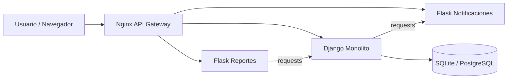

# Sistema de Gestión de Reservas de Canchas Deportivas
## Desarrollado por: Mateo Sanz Medina, Jose Miguel Sánchez, Samuel Arango Echeverri

Este proyecto es una plataforma digital desarrollada en Django para la gestión de reservas de canchas deportivas. Actualmente mantiene el monolito principal en Django, un microservicio Flask de notificaciones y un microservicio Flask de reportes, todo detrás de un API Gateway con Nginx.

## Características Principales

- **Gestión de Usuarios**: Registro y autenticación de usuarios.
- **Gestión de Canchas**: Administración de diferentes tipos de canchas (fútbol, tenis, pádel, etc.) con sus tarifas y disponibilidad.
- **Reservas**: Sistema para consultar disponibilidad y reservar canchas en fechas y horarios específicos.
- **Pagos**: Registro de transacciones asociadas a las reservas.
- **Notificaciones**: Sistema de notificaciones (correo electrónico/sms simulado) para confirmar reservas.

## Tecnologías Utilizadas

- **Backend Monolito**: Python 3, Django
- **Microservicio (Notificaciones)**: Python 3, Flask
- **Microservicio (Reportes)**: Python 3, Flask
- **Orquestación y API Gateway**: Docker, Docker Compose, Nginx
- **Base de Datos**: SQLite (por defecto en desarrollo), compatible con PostgreSQL/MySQL via configuración.

## Arquitectura Actual



El gateway enruta:
- `/` hacia Django.
- `/api/notifications/` hacia el microservicio de notificaciones.
- `/api/reports/` hacia el microservicio de reportes.

## Variables de Entorno

Copiar `.env.example` a `.env` y ajustar según el entorno.

- `SECRET_KEY`: clave secreta de Django.
- `DEBUG`: activa o desactiva el modo depuración.
- `ALLOWED_HOSTS`: lista separada por comas.
- `DATABASE_URL`: conexión a PostgreSQL o SQLite.
- `MICROSERVICE_NOTIF_URL`: URL interna del microservicio de notificaciones.
- `MICROSERVICE_REPORTS_URL`: URL interna del microservicio de reportes.
- `ALLIED_TEAM_API_URL`: URL configurable del equipo aliado.
- `WEATHER_API_KEY` y `WEATHER_API_URL`: reservadas para la integración vía Adapter.
- `CELERY_BROKER_URL` y `CELERY_RESULT_BACKEND`: reservadas para tareas asíncronas.

## Endpoints JSON Relevantes

- `GET /api/system/summary/`: resumen del sistema con usuarios, canchas, reservas y pagos.
- `GET /api/reports/summary/`: resumen consumido por el microservicio de reportes.
- `GET /api/notifications/health`: salud del microservicio de notificaciones.
- `GET /api/reports/health`: salud del microservicio de reportes.

## Asincronía con Celery / Redis

La creación de reservas dispara una tarea Celery para enviar la notificación de confirmación sin bloquear la respuesta principal.

- Broker: Redis.
- Worker: `celery -A gestion_canchas worker -l info`.
- En desarrollo local, la tarea se ejecuta en modo eager para no depender de Redis.
- En Docker Compose, `CELERY_TASK_ALWAYS_EAGER=False` activa el flujo asincrónico real.

Para verificarlo:

1. Arranca el stack con Docker Compose.
2. Crea una reserva.
3. Revisa que el worker reciba la tarea y que la notificación aparezca en la tabla de notificaciones.

## Internacionalización

La base de i18n ya está preparada con `LocaleMiddleware`, `LANGUAGES`, carpetas `locale/es` y `locale/en`, y un selector de idioma en la navbar.

Comandos útiles:

```bash
django-admin makemessages -l en
django-admin compilemessages
```

La traducción completa de templates queda como siguiente pasada; por ahora ya puedes cambiar entre español e inglés desde la interfaz.

## Estructura del Proyecto

El proyecto está compuesto por un monolito y un microservicio orquestados mediante contenedores:

- `gestion_canchas/`: Configuración principal del proyecto Django.
- `reservas/`: Aplicación principal que contiene la lógica de negocio (Modelos, Vistas, URLs).
- `micro_notificaciones/`: Microservicio en Flask extraído usando el patrón Strangler.
- `nginx/`: Configuración del API Gateway que enruta el tráfico.
- `docker-compose.yml`: Archivo de orquestación para levantar todos los servicios.
- `manage.py`: Utilidad de línea de comandos de Django.

### Modelos de Datos

El sistema se basa en los siguientes modelos principales (definidos en `reservas/models.py`):

1.  **Usuario**: Almacena información de los clientes del complejo.
2.  **Cancha**: Define las propiedades de las instalaciones deportivas (tipo, ubicación, tarifa).
3.  **Reserva**: Relaciona un usuario con una cancha en un horario específico.
4.  **Pago**: Registra el estado de los pagos de las reservas.
5.  **Notificacion**: Historial de comunicaciones enviadas a los usuarios.

## Configuración e Instalación

### Método 1: Ejecución con Docker (Recomendado - Arquitectura Strangler Pattern)

Gracias a la implementación del **Strangler Pattern**, el sistema funciona orquestando el monolito (Django) y los microservicios Flask a través de un API Gateway (Nginx).

1.  Asegúrate de tener instalado **Docker** y **Docker Compose**.
2.  En la raíz del proyecto, ejecuta:
    ```bash
    docker compose up --build
    ```
3.  El proyecto estará disponible en `http://localhost/` (puerto 80). Nginx enrutará `/` a Django, `/api/notifications/` al microservicio Flask de notificaciones y `/api/reports/` al microservicio Flask de reportes.

### Método 2: Ejecución Local Tradicional (Solo Django)

1.  **Clonar el repositorio**:
    ```bash
    git clone <url-del-repositorio>
    cd <nombre-del-directorio>
    ```

2.  **Crear un entorno virtual** e instalar dependencias:
    ```bash
    python -m venv venv
    venv\Scripts\activate  # En Windows
    # source venv/bin/activate  # En Mac/Linux
    pip install -r requirements.txt
    ```

3.  **Aplicar migraciones y ejecutar**:
    ```bash
    python manage.py migrate
    python manage.py runserver
    ```
    El monolito estará disponible en `http://127.0.0.1:8000/`.

## Cómo Probar la Fase Actual

1.  Inicia la app local o con Docker.
2.  Abre `http://127.0.0.1:8000/api/system/summary/` y verifica el JSON.
3.  Abre `http://localhost/api/reports/summary/` si estás usando Docker y confirma que devuelve el resumen proxyado desde Django.
4.  Inicia sesión como administrador para revisar el panel de pagos.

## Despliegue en AWS EC2

Este proyecto está listo para ejecutarse en una instancia EC2 de AWS Academy usando Docker Compose.

### Requisitos de la instancia

- Ubuntu 22.04 o Amazon Linux 2023.
- Puertos abiertos en el Security Group: `22`, `80`, `8000`, `5001`, `5002`, `5003`, `5432`, `6379`.

### Instalación en Ubuntu 22.04

```bash
sudo apt update
sudo apt install -y ca-certificates curl gnupg git
curl -fsSL https://get.docker.com | sudo sh
sudo usermod -aG docker $USER
newgrp docker
sudo apt install -y docker-compose-plugin
```

### Instalación en Amazon Linux 2023

```bash
sudo dnf update -y
sudo dnf install -y git
sudo dnf install -y docker
sudo systemctl enable docker
sudo systemctl start docker
sudo usermod -aG docker ec2-user
newgrp docker
sudo dnf install -y docker-compose-plugin
```

### Despliegue

```bash
git clone <url-del-repositorio>
cd GestionReservas
cp .env.example .env
docker compose up --build -d
```

### Acceso público

- Nginx es el punto de entrada público en `http://<IP_PUBLICA>/`.
- Django queda detrás de Nginx.
- Las APIs de notificaciones y reportes también quedan expuestas por Nginx en sus rutas correspondientes.

### Verificación rápida

```bash
docker compose ps
docker compose logs -f nginx
docker compose logs -f monolito_django
docker compose logs -f celery_worker
```

### Variables críticas antes de levantar

- `SECRET_KEY`
- `DEBUG=False`
- `ALLOWED_HOSTS=<IP_PUBLICA>,<DNS>`
- `DATABASE_URL`
- `ALLIED_TEAM_API_URL`
- `WEATHER_API_URL`
- `WEATHER_API_KEY`

## Checklist de Sustentación

- El monolito Django sigue funcionando como aplicación principal.
- Nginx enruta el tráfico hacia Django y los microservicios Flask.
- Existe un endpoint JSON propio de resumen del sistema.
- La notificación se programa asíncronamente con Celery/Redis.
- La interfaz soporta selector de idioma.
- La integración con API aliada es configurable por `.env`.
- El patrón Adapter está preparado para el clima con fallback seguro.

## Uso

- Acceder al panel de administración en `http://127.0.0.1:8000/admin/` (requiere crear un superusuario con `python manage.py createsuperuser`).
- Desde allí se pueden gestionar usuarios, canchas y reservas.

## Roadmap de Arquitectura

- Fase 1: configuración por entorno, gateway y endpoints JSON base.
- Fase 2: Celery/Redis para tareas asíncronas.
- Fase 3: i18n completo con `gettext`.
- Fase 4: integración del equipo aliado y patrón Adapter para clima.
- Fase 5: documentación de despliegue AWS EC2 y hardening de producción.

## Contribución

1.  Hacer un Fork del proyecto.
2.  Crear una rama para tu funcionalidad (`git checkout -b feature/nueva-funcionalidad`).
3.  Hacer commit de tus cambios (`git commit -m 'Aañadir nueva funcionalidad'`).
4.  Hacer push a la rama (`git push origin feature/nueva-funcionalidad`).
5.  Abrir un Pull Request.
